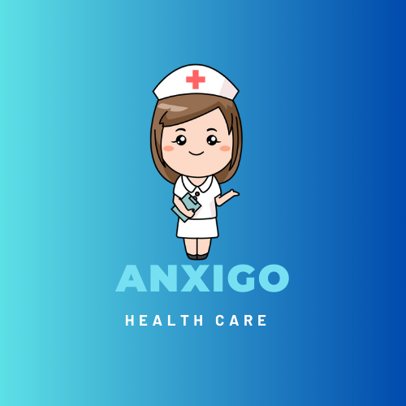
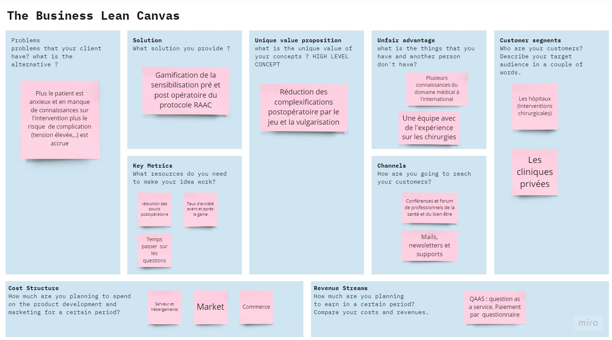
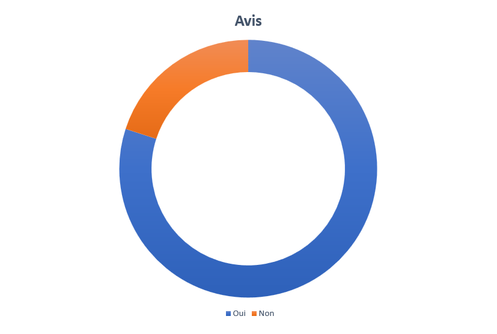
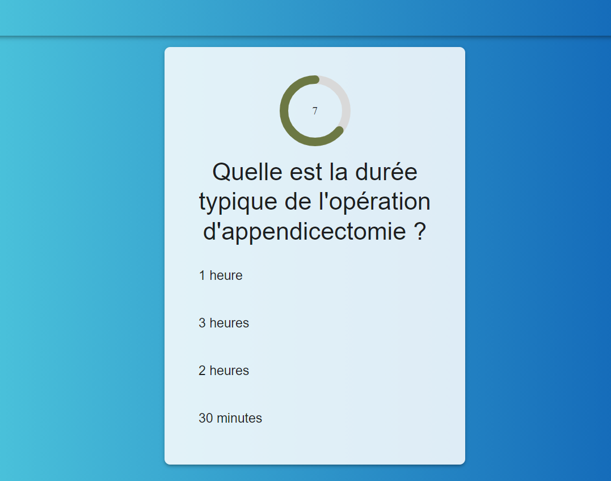
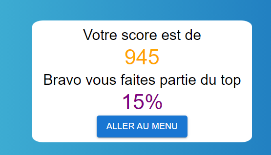
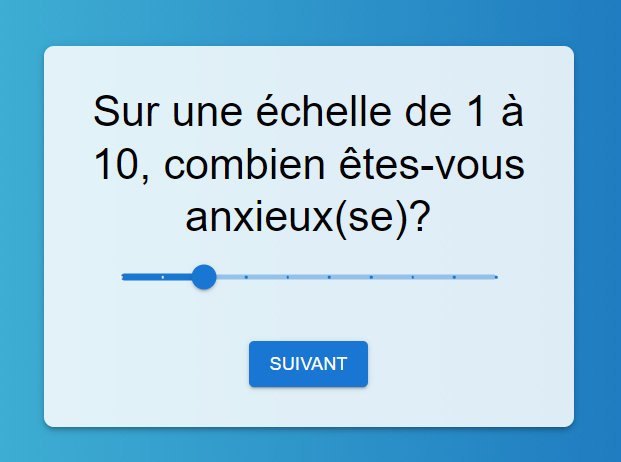
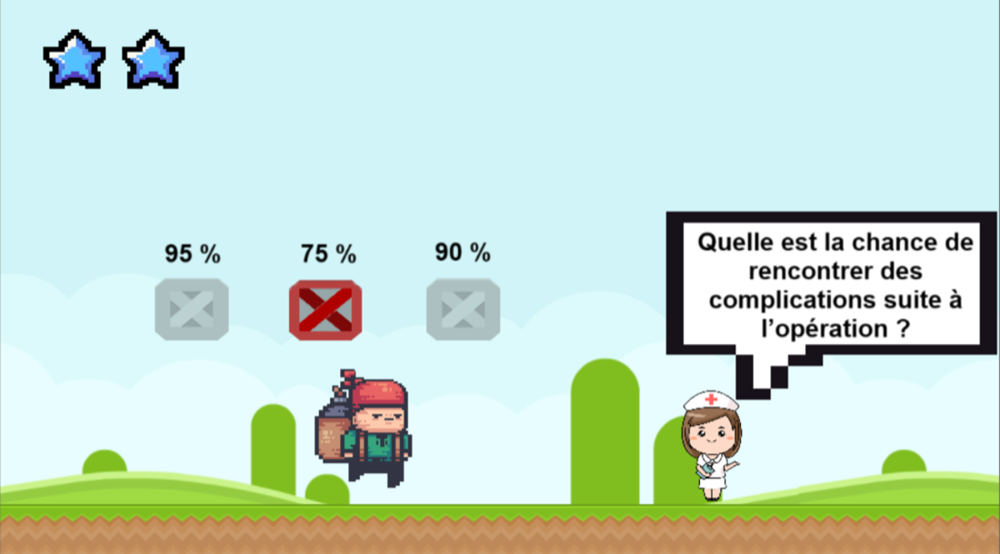

# ANXIGO

## Table des matières
- [ANXIGO](#anxigo)
  - [Table des matières](#table-des-matières)
  - [Introduction](#introduction)
  - [Installation et lancement](#installation-et-lancement)  
- [Protocole RAAC](#protocole-raac)
    - [sources](#sources)
- [Jeu ANXIGO](#jeu-anxigo)
  - [Buisness Model](#buisness-model)
  - [Etude du marché](#etude-du-marché)
  - [Présence en ligne](#présence-en-ligne)
  - [Game Play](#game-play)
  - [Axes d'amélioration](#axes-damélioration)
- [Collaborateurs](#collaborateurs)  

## Introduction
**ANXIGO** est un jeu web qui s'integre dans le protocol RAAC pour permettre aux patients de mieux  appréhender les interventions chirurgicales. L'objectif et de prevenir des problèmes post et pré opératoire en permettant aux patients de mieux comprendre les interventions chirurgicales et les risques qui y sont associés.  

Ce repos contient le code source du jeu **ANXIGO** qui dans la version actuelle gére trois type d'interventions chirurgicales.  

### Installation et lancement
L'application est faite en react et peut être lancée en local en suivant les étapes suivantes:
1. Cloner le repos
2. Se rendre dans le dossier game-erac et Installer les dépendances avec `npm install`
3. Lancer le serveur avec `npm run dev`
4. Se rendre sur `localhost:5173` pour accéder au jeu

## Protocole RAAC

Le terme "**RAAC**" fait référence au "**Rétablissement Amélioré Après Chirurgie**" **(RAAC)**, également connu sous le nom de "**Fast Track**" en anglais. Il s'agit d'un ensemble de protocoles et de pratiques médicales visant à optimiser la récupération des patients après une intervention chirurgicale. L'objectif principal du RAAC est d'accélérer le rétablissement des patients, de réduire les complications postopératoires et de raccourcir la durée de séjour à l'hôpital.  
  
Les principaux éléments du protocole RAAC incluent :  
  
1. **Préparation préopératoire**: Les patients sont préparés avant l'intervention chirurgicale avec des informations sur ce à quoi s'attendre, des instructions sur la nutrition, la gestion de la douleur et les informations postopératoires.

2. Analgésie optimisée: Le contrôle de la douleur est géré de manière optimale, souvent en utilisant des techniques telles que l'analgésie contrôlée par le patient (PCA) et des médicaments spécifiques qui minimisent les effets secondaires.  

3. chirurgie minimale invasive: Lorsque cela est possible, des techniques chirurgicales minimales invasives sont utilisées pour réduire le traumatisme corporel.  

4. Alimentation précoce: Les patients sont encouragés à reprendre rapidement une alimentation normale après la chirurgie pour favoriser la récupération.    

5. Mobilité précoce: Les patients sont encouragés à se lever et à bouger dès que possible après l'opération pour prévenir les complications liées à l'immobilité.  

6. Gestion du stress péri-opératoire: Les techniques de gestion du stress et de la relaxation sont souvent utilisées pour réduire l'anxiété des patients avant l'intervention chirurgicale.  

7. Départ précoce de l'hôpital: Les patients sont généralement encouragés à quitter l'hôpital plus tôt que dans les protocoles traditionnels, dès lors qu'ils sont jugés médicalement stables.  

Le RAAC est conçu pour améliorer l'expérience du patient, réduire les complications postopératoires, raccourcir les temps de récupération et réduire les coûts de soins de santé associés à une hospitalisation prolongée. Il est de plus en plus utilisé dans le domaine de la chirurgie pour de nombreuses procédures, notamment la chirurgie colorectale, la chirurgie orthopédique, la chirurgie cardiaque et d'autres interventions chirurgicales majeures.  

Notre jeu **ANXIGO** va traiter notamment le cas du premier élément du protocole RAAC qui est la **Préparation préopératoire** et va surtout cherché à l'améliorer. Le jeu va permettre aux patients de mieux comprendre les interventions chirurgicales et les risques qui y sont associés via un jeu ludique.  

Les chiffres de differentes études montrent qu'on a **91%** qui ont très bonne expérience lors d'une chirurgie avec le protocole RAAC contre **75%** sans le protocole RAAC.  
Notre objectif avec le jeu **ANXIGO** est d'augmenter ce chiffre à **95%**.

#### Sources
- [Etude sur la césarienne](https://fondation-apicil.org/wp-content/uploads/2023/03/07DEC2022_CP-PROJET-ChroCe%CC%81RAAC-MAJ-corre-ctionsSL.pdf)
- [Chirurgie orthopédique](https://www.sciencedirect.com/science/article/abs/pii/S1877051723000588)
- [RAAC dans l'ambulatoire](https://www.sciencedirect.com/science/article/abs/pii/S1279796020301480)
- [Evaluation satisfaction RAAC](https://www.sciencedirect.com/science/article/abs/pii/S1166708719303070#preview-section-abstract)
- [Chirurgie thoracique](https://www.researchgate.net/profile/Francois-Montagne/publication/355266773_Recuperation_amelioree_apres_chirurgie_RAAC_thoracique/links/616dadf0b90c51266265d661/Recuperation-amelioree-apres-chirurgie-RAAC-thoracique.pdf)

## Jeu ANXIGO
Notre jeu va  permettre aux médécins qui souhaitent utiliser le protocole RAAC de mieux préparer leurs patients en leur permettant de mieux comprendre les interventions chirurgicales et les risques qui y sont associés via des quiz ludiques. L'objectif est de reduire les problèmes post et pré opératoire en reduisant le stress des patients.

  

### Buisness Model
Nos principaux clients sont les hôpitaux et les cliniques qui souhaitent utiliser le protocole RAAC. Nous allons leur proposer un systéme de *question as a service* comme methode de révenu. En gros ils paieront aux nombres de questionnaires complétés par mois.  

Voici le **Business lean canvas** de notre projet:  

### Etude du marché
Pour avoir un premier apperçu de la problématique que nous souhaitons traiter, qui est la reduction des problèmes post et pré opératoire, en offrant une meilleure préparation préopératoire aux patients, nous avons fait une étude de marché.  

Nous avons réalisé un sondage sur instagram auprès de 250 pérsonnes pour voir si le fait d'en apprendre plus sur les interventions qu'ils vont subir ou qu'ils ont subi les aideraient à mieux appréhender l'intervention.  

Voici les résultats de l'étude: 

  

Plus de **80%** des personnes interrogées ont répondu que le fait d'en apprendre plus sur les interventions qu'ils vont subir ou qu'ils ont subi les aideraient à mieux appréhender l'intervention.

### Présence en ligne
Nous avons crée un site vitrine pour présenter notre projet et permettre aux clients de nous contacter. L'objectif est d'y publier nos études et les divers améliorations que nous envisageons d'apporter au projet.  
Le site est disponible à l'adresse suivante: [anxigo](https://killertottte.wixsite.com/anxigo)

### Game Play
Le jeu est un Quizz qui se présente sous forme de questions à choix multiples et des questions à réponse libre.  

  

L'objectif est de répondre aux questions avant la fin du temps imparti.  
A la fin de chaque question, la réponse est donnée avec une explication approfondie et ludique pour permettre aux patients de mieux comprendre les interventions chirurgicales et les risques qui y sont associés.  
Les questions sont mises en place de façon intelligente en fonction des questions qui rassurent le plus le patient et qui permettent de mieux le préparer à l'intervention. 
  
A la fin du jeu, le patient peut voir son score et la tranche de pourcentage dans laquelle il se situe. 

  

Au début du jeu, on demande au patient de se noter sur une échelle de 1 à 10 sur son niveau de stress.  

On refait la même chose à la fin du jeu pour voir si le jeu a permis de réduire le stress du patient. Si c'est pas le cas, une proposition de consultation avec un professionnel de santé peut être faite.

### Axes d'amélioration
Nous avons identifié plusieurs axes d'amélioration pour notre projet. Une que nous avons jugé importante est la mise en place de jeu plus ou moins adapté à l'âge et à la maturité du patient. 
La version actuelle se veut être un jeu pour tout le monde mais nous pensons qu'il serait plus efficace de faire des versions adaptées à chaque tranche surtout pour les enfants.  

Une idée du jeu au niveau du design serait de s'inspirer de l'univers Mario pour rendre le jeu plus ludique.

  

Il s'agit juste d'un croquis mais nous pensons faire des adaptations plus poussées et plus larges pour mieux cibler les patients et les aider au mieux à mieux appréhender l'intervention.  
Il est question ici de faire la part des chose entre le côté ludique, informatif, pédagogique et pragmatique du jeu pour les differents profils de patients.  
  
## Collaborateurs
- [Myriam WARD](https://www.linkedin.com/in/myriam-ward-71b4a9233)
- [Agustin BOUCHON](https://www.linkedin.com/in/agustin-bouchon-baaa3b21b)
- [Karim SALHI](https://www.linkedin.com/in/karimsalhii)
- [Sabir MOHAMED](https://www.linkedin.com/in/sabir-mba)
